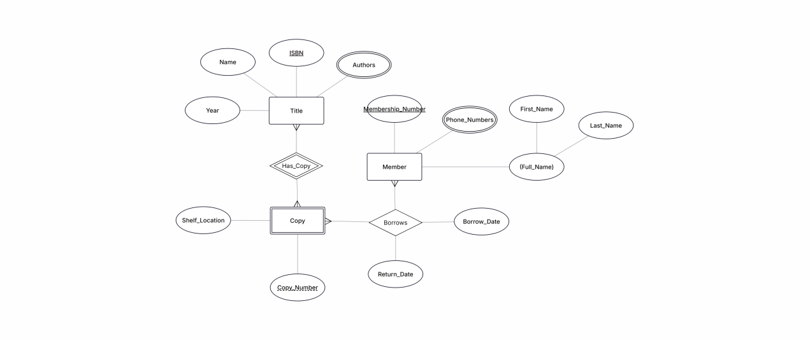
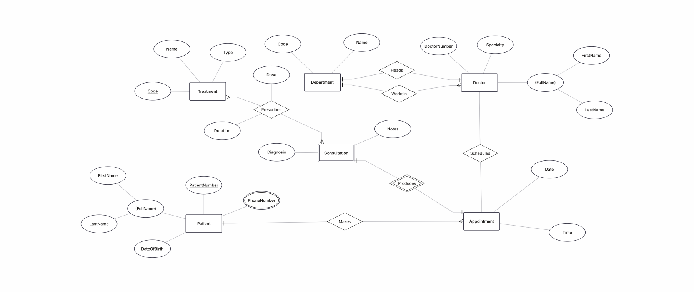
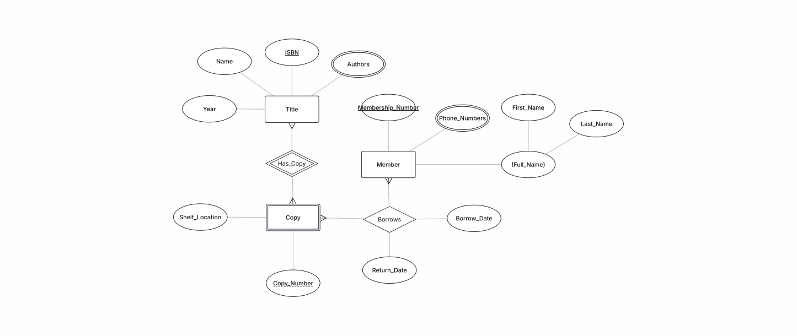

# Entity-Relationship (ER) Modeling

## 1. Guided Example: University Registration System
A conceptual database design for university course registration and department management.
**Key Entities:** Student, Course, Lecturer, Department.

### ER Diagram

### Key Relationships & Constraints
| Relationship | Participating Entities | Cardinality | Justification                                                                            |
| :--- | :--- | :--- |:-----------------------------------------------------------------------------------------|
| **Register** | Student – Course | M:N | A student can register for multiple courses, and a course can have multiple students enrolled. |
| **Teach** | Lecturer – Course | 1:N | A lecturer teaches multiple courses, but each course is taught by exactly one lecturer.  |
| **Offer** | Department – Course | 1:N | A department offers multiple courses, but each course is offered by exactly one department. |
| **Belong** | Lecturer – Department | 1:N | A lecturer belongs to exactly one department, while a department has multiple lecturers. |

---

## 2. Case Study: Clinic Management System
A database design for a clinic management system.
**Key Entities:** Patient, Doctor, Treatment, Consultation, Appointment, Department.

### ER Diagram

### Key Relationships & Constraints

| Relationship | Participating Entities | Cardinality | Justification                                                                                   |
| :--- | :--- | :--- |:------------------------------------------------------------------------------------------------|
| **WorksIn** | Doctor – Department | N:1 | Every doctor works in exactly one department (Total participation on Doctor).                   |
| **Books** | Patient – Appointment | 1:N | A patient can book multiple appointments, but each appointment belongs to one specific patient. |
| **AssignedTo** | Doctor – Appointment | 1:N | A doctor can handle many appointments, but each appointment is assigned to one doctor.          |
| **Produces** | Appointment – Consultation | 1:1 | Each appointment produces exactly one consultation record (Identifying relationship).           |
| **Issues** | Consultation – Prescription | 1:N | A single consultation session can result in one or multiple medical prescriptions.              |

---

## 3. Case Study: Library Management System
A database design for a small library system.
**Key Entities:** Title, Copy (Weak Entity), Member.

### ER Diagram

### Key Relationships & Constraints

| Relationship | Participating Entities | Cardinality | Justification |
| :--- | :--- | :--- | :--- |
| **Publishes** | Publisher – Title | 1:N | A publisher can publish many titles, but each title is published by exactly one publisher. |
| **HasCopies** | Title – Copy | 1:N | A title can have multiple physical copies. "Copy" is a weak entity dependent on "Title". |
| **Borrows** | Member – Loan | 1:N | A library member can have multiple loan/borrowing records over time. |
| **Involves** | Copy – Loan | 1:N | A specific book copy can be associated with multiple loan records (borrowed multiple times). |